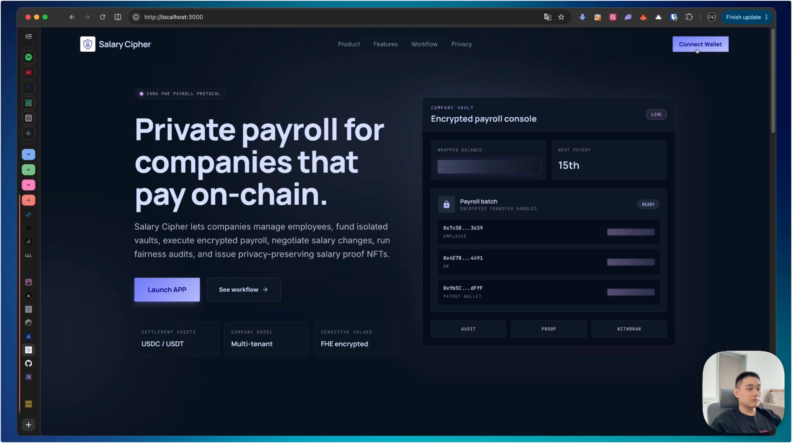

# Salary Cipher

## Overview

Salary Cipher is a platform for managing employee salaries and related financial operations. It allows companies to securely store and manage employee salaries, as well as to negotiate salaries with employees. It is built on top of the Zama Protocol FHE technology.

## Introduction

More information about Salary Cipher can be found [Here](./docs/INTRODUCTION.md).

## Video demo

A video demo of Salary Cipher can be found [Here](https://x.com/BTBMannn/status/2053319932520333544).

