# SalaryCipher 中文项目介绍

## 1. 项目名称

**SalaryCipher**

链上隐私薪资管理平台。

## 2. 项目介绍

SalaryCipher 是一个面向企业和 Web3 团队的多租户薪资管理 dApp。多个公司可以共用同一套平台合约，每家公司通过独立 `companyId`、独立角色权限、独立发薪配置和独立资金金库隔离数据与资产。公司可以在链上创建组织、管理员工、设置加密月薪、充值 USDC / USDT、转换为 cUSDC / cUSDT，并向员工发放 confidential token 薪资。

传统链上支付的最大问题是透明度过高：只要知道一个员工钱包地址，任何人都能查到该员工收到多少工资、来自哪个公司、多久发一次薪。SalaryCipher 使用 Zama FHE 把薪资金额和关键结论加密，使企业可以保留链上资产结算的可验证性，同时保护员工收入隐私和公司人力成本隐私。

当前版本的核心目标是展示一条完整、真实、可扩展到多家公司的加密薪资业务链路：公司创建、资产选择、金库创建、员工入职、加密薪资写入、资金充值与 wrap、加密发薪、员工查看加密余额、员工 unwrap 提现、薪资历史索引、加密调薪谈判。

## 3. 项目解决的问题

### 3.1 员工薪资在链上裸奔

普通 ERC20 转账金额完全公开。员工之间、外部分析者、竞争对手都能通过区块浏览器分析薪资和公司支出。

SalaryCipher 的处理方式：

- 员工月薪以 FHE 加密值存储。
- 发薪金额以 confidential token 转账。
- 历史发薪金额只保存加密 handle。
- 只有员工本人、Owner / HR 等授权角色可以解密对应数据。

### 3.2 企业无法安全使用链上薪资工具

企业希望使用稳定币结算工资，但又不能公开薪酬结构、团队成本和人员变化。

SalaryCipher 的处理方式：

- 每家公司拥有独立金库。
- 公司选择 USDC 或 USDT 作为薪资资产。
- 金库把公开 ERC20 wrap 成 confidential token。
- 发薪由合约触发，资金从公司金库直接转到员工收款地址。

### 3.3 调薪谈判会暴露双方底线

薪资谈判中，公司报价和员工期望都是敏感信息。

SalaryCipher 的处理方式：

- Owner 和员工都可以发起调薪谈判。
- 公司报价和员工期望都以加密形式提交。
- 合约在密文下判断 `employeeAsk <= employerOffer`。
- 双方只解密最终结论：Matched / Not Matched。
- 匹配后 Owner 可以把加密结果应用为正式月薪。

### 3.4 合规审计需要结论，但不应暴露明细

HR 或 Owner 可能需要知道薪资差距是否合理，但不应该在审计过程中暴露每个员工的明文薪资。

SalaryCipher 的处理方式：

- 合约在密文下累计薪资、比较最高值和最低值。
- 审计结果以加密布尔值保存。
- 授权角色只解密结论，而不是所有明细。

### 3.5 多家公司需要共用平台，但数据和资产必须隔离

真实薪资平台会服务很多公司。如果每创建一个公司都单独维护一整套系统，部署成本、升级成本、前端索引成本和运维复杂度都会变高。

SalaryCipher 的处理方式：

- 所有公司共用平台级 Registry、Core、Negotiation 等核心合约。
- 每家公司通过 `companyId` 隔离公司资料、员工、角色、薪资配置和发薪历史。
- 每家公司拥有独立 `CompanyTreasuryVault`，资产不会混在同一个金库里。
- 每家公司可以独立选择 USDC 或 USDT 作为薪资结算资产。
- 用户可以同时属于多家公司，并在前端切换当前公司和当前角色。

## 4. 产品功能介绍

### 4.1 钱包登录与路由权限

- 用户通过钱包连接进入系统。
- Landing page 以外的页面都需要登录。
- 未登录访问应用页会回到首页。
- 登录后如果没有公司，会进入创建公司页面。
- 登录后如果已有公司但未选择公司，会进入公司选择页。
- 页面和侧边栏菜单根据当前公司角色裁剪。

### 4.2 公司创建与公司选择

- 用户可以创建公司，创建者自动成为 Owner。
- 创建公司时设置公司名称、每月发薪日、薪资结算资产。
- 支持 USDC 和 USDT 两种结算资产。
- 创建公司通过 `SalaryCipherFactory` 完成，工厂会同时创建公司记录和公司独立金库。
- 用户加入多个公司时，可以在公司选择页或顶部公司切换弹窗中切换。

### 4.3 多租户公司模型

- 平台支持多个公司同时运行在同一套合约系统中。
- `CompanyRegistry` 使用 `companyId` 管理每个公司的公司资料、员工列表、角色、发薪配置、结算资产和金库地址。
- `SalaryCipherCore` 使用 `companyId + employee` 保存每个公司下的员工加密月薪和入职日期。
- `SalaryNegotiation` 使用 `companyId + employee` 保存每个员工在对应公司内的调薪谈判历史。
- `CompanyTreasuryVault` 按公司独立部署，每家公司只有自己的 Owner 可以管理资金。
- 前端的公司选择器会按当前钱包读取所有所属公司，并按不同角色切换菜单和数据。

### 4.4 多角色权限

| 角色     | 权限                                                                             |
| -------- | -------------------------------------------------------------------------------- |
| Owner    | 创建公司、管理员工、配置发薪日、执行发薪、管理金库、查看公司级历史、参与调薪谈判 |
| HR       | 管理员工、查看人员和薪资相关数据、执行部分薪资管理操作                           |
| Employee | 查看自己的薪资、余额和历史记录，发起自己的调薪谈判，unwrap 已发薪资              |

### 4.5 人员管理

- Owner / HR 可以添加员工。
- 添加员工时填写员工 account、显示名称、角色、月薪。
- 员工 account 与 payout wallet 是不同字段。
- 默认 payout wallet 等于员工 account，后续员工可以修改自己的收款地址。
- Owner / HR 可以编辑员工名称、角色。
- 员工 account 不允许在编辑时修改。
- 删除员工会触发离职结算，合约会计算未覆盖期间应发工资并转账。
- 月薪使用 `EncryptedField` 展示，授权用户点击后解密。

### 4.6 薪资配置与发薪

- 公司按“每月几号发薪”配置，不使用固定秒数周期。
- 每次发薪日结算上一个完整自然月的工作量。
- 员工完整覆盖上月时直接发整月月薪。
- 员工未完整覆盖上月时按上月真实天数折算。
- 当月入职且尚未形成上一个完整自然月工作量时，应发金额为 0。
- Owner / HR 可以点击立即发薪。
- 立即发薪会提前执行最近一个未结算发薪日，但仍按上一个完整自然月计算。
- 发薪完成后，员工的 confidential token 余额增加，金库余额减少。

### 4.7 财务与金库

- 每家公司有独立 `CompanyTreasuryVault`。
- Owner 可以充值公司选择的 underlying token，例如 USDC / USDT。
- 充值后金库调用 wrapper，把 underlying token wrap 成 cUSDC / cUSDT。
- Owner 可以查看公司金库 wrapped balance，余额为加密字段。
- Owner 可以查看未 wrap 的 underlying token 余额。
- Owner 可以把金库剩余 wrapped balance 发起 unwrap 退款。
- 员工可以把自己收到的 confidential token unwrap 成公开 ERC20。

### 4.8 薪资历史

- Owner / HR 可以查看公司内所有员工的发薪历史。
- Employee 只查看自己的发薪历史。
- 历史金额来自 ERC7984 confidential transfer 事件中的加密 handle。
- 前端通过事件索引展示 block number、交易链接、收款人、状态和加密金额。
- Overview 只展示最近 5 条，Payroll 页面展示完整历史。

### 4.9 加密调薪谈判

- 只能对在职的 HR / Employee 发起。
- Owner 可以为任意员工发起。
- 员工可以为自己发起。
- Owner 提交 employer offer。
- 员工提交 employee ask。
- 双方提交后，合约计算是否匹配。
- 结果是加密 `ebool`，只有 Owner 和对应员工可以解密。
- 匹配成功后，Owner 可以应用新月薪。
- 匹配失败后，双方可以开启新一轮。
- 原始报价不对外开放解密，避免调薪过程暴露公司预算上限或员工心理预期。
- 同一员工同一时间只能有一个 active negotiation，避免多轮谈判结果相互冲突。

### 4.10 Overview

Owner / HR 视角：

- 员工数量。
- 总月薪额。
- 下次发薪日。
- 最近发薪历史。
- 公司 payroll 状态。

Employee 视角：

- 我的月薪。
- 我的 confidential token 余额。
- 我的累计已收。
- 我的下次发薪日。

### 4.11 Compliance 与薪资证明

当前设计中包含两个合规模块：

- 薪资公平审计：合约在密文下计算薪资分布和差距结论。
- RWA 薪资证明：员工可以生成“月薪满足某个条件”的链上隐私证明，可进一步铸造为 NFT。

这部分用于展示 FHE 在薪资数据合规和收入证明场景中的扩展价值：第三方可以验证结论，但不需要看到具体工资。

## 5. FHE 在真实场景中的应用价值

SalaryCipher 不是把数据加密后简单存到链上，而是在真实薪资流程中使用 FHE 完成计算。

| 场景                | 没有 FHE 的问题                      | 使用 FHE 后                                    |
| ------------------- | ------------------------------------ | ---------------------------------------------- |
| 员工月薪            | 明文上链会泄露收入                   | 月薪加密存储，授权解密                         |
| 发薪金额            | 转账金额公开                         | 使用 confidential token 进行加密转账           |
| 金库余额            | 外部可分析公司现金流                 | wrapped balance 加密展示                       |
| 离职结算            | 需要公开计算工资                     | 合约在密文下计算应发金额                       |
| 加密竞价 / 调薪谈判 | 双方报价会暴露底线                   | 报价加密，只公开是否匹配                       |
| 薪资审计            | 审计会暴露个人薪资                   | 只解密结论，不暴露明细                         |
| 收入证明            | 证明收入通常暴露具体金额             | 只证明条件成立                                 |
| 多租户薪资平台      | 多家公司共用系统时容易混淆权限和资产 | 用 `companyId` 隔离数据，用独立 vault 隔离资产 |

FHE 的价值在于：链上合约可以对加密数据做加法、乘法、除法、比较和条件选择，业务规则仍然由合约强制执行，但链上观察者无法读取原始数据。

## 6. 产品优势

### 6.1 多租户平台模型

SalaryCipher 可以让很多公司共用一套合约系统，而不需要每家公司重复部署完整合约。平台通过 `companyId` 隔离公司、员工、角色、薪资、谈判和历史数据，通过独立 `CompanyTreasuryVault` 隔离每家公司的资金。这种设计更接近真实 SaaS 薪资平台，也更适合未来扩展到大量企业用户。

### 6.2 真实资产流，不是演示账本

SalaryCipher 使用 OpenZeppelin Confidential Contracts 的 ERC7984 wrapper。公司充值公开 ERC20 后 wrap 成 confidential token，发薪时转出的是真实 confidential asset，而不是合约内部的普通记账字段。

### 6.3 公司级金库隔离

每家公司拥有独立金库。平台核心合约使用 `companyId` 隔离业务数据，但资产托管由每家公司自己的 vault 承担，便于隔离风险、查看余额和处理退款。

### 6.4 加密竞价式调薪谈判

SalaryCipher 把薪资谈判设计成双方加密报价的匹配流程。Owner 的 employer offer 和员工的 employee ask 都不会公开，合约只在密文下判断是否匹配。双方只看到 Match / No Match，匹配后再由 Owner 应用新月薪。这能展示 FHE 对“隐私比较”场景的直接价值，也让调薪谈判从普通表单升级为可验证的链上隐私协商。

### 6.5 发薪规则贴近真实工资场景

薪资按自然月计算，而不是简单按 30 天或固定秒数周期计算。每月发薪日结算上一个完整自然月，未满月员工按实际天数折算。

### 6.6 权限与解密边界清晰

不同角色看到不同页面、不同列表、不同按钮和不同解密能力。未授权用户即使能看到链上 handle，也无法解密金额。

### 6.7 前端与合约流程完整

项目包含 Next.js 前端、Hardhat Ignition 部署、Solidity 合约、Zama FHE 加密输入、wagmi 链上读写、事件索引、加密字段解密组件和测试套件。

## 7. 如何使用 Zama FHE

### 7.1 加密输入

前端使用 Zama relayer / FHE SDK 对用户输入的金额进行加密，生成 encrypted handle 和 input proof。

示例场景：

- 添加员工时加密月薪。
- 编辑员工时加密新月薪。
- 调薪谈判时加密 employer offer 和 employee ask。

合约接收 `externalEuint128` 和 `inputProof`，通过 `FHE.fromExternal` 转为链上可计算的加密数值。

### 7.2 密文存储

核心加密字段包括：

| 字段                 | 类型                   | 合约                                        |
| -------------------- | ---------------------- | ------------------------------------------- |
| 员工月薪             | `euint128`             | `SalaryCipherCore`                          |
| 发薪金额             | `euint64` / `euint128` | `SalaryCipherCore` + `CompanyTreasuryVault` |
| 金库 wrapped balance | `euint64`              | ERC7984 wrapper                             |
| 调薪报价             | `euint128`             | `SalaryNegotiation`                         |
| 谈判匹配结果         | `ebool`                | `SalaryNegotiation`                         |
| 审计总额             | `euint128`             | `SalaryCipherCore`                          |
| 审计结论             | `ebool`                | `SalaryCipherCore`                          |

### 7.3 多租户下的 FHE 权限控制

SalaryCipher 的 FHE 授权不是全局开放，而是按公司和角色分配。员工只能解密自己在当前公司内的工资和收款历史；Owner / HR 只能解密自己管理公司内的数据；一个用户加入多家公司时，不同公司的加密 handle 权限彼此独立。这样可以支持同一个钱包在 A 公司是 Owner、在 B 公司是 Employee 的真实多租户场景。

### 7.4 密文计算

合约使用 FHE 运算完成业务逻辑：

- `FHE.add`：累计薪资、累计应发金额。
- `FHE.mul` / `FHE.div`：按实际工作天数折算工资。
- `FHE.le` / `FHE.ge` / `FHE.eq`：谈判匹配、薪资证明、审计比较。
- `FHE.select`：在密文条件下选择结果，保证 false 结果也可解密。
- `FHE.asEuint` / `FHE.asEbool`：初始化加密常量。

### 7.5 解密授权

合约通过 `FHE.allow` 和 `FHE.allowThis` 控制谁能解密：

- 员工月薪：员工本人、Owner、HR、核心合约。
- 发薪转账金额：员工本人和有管理权限的角色。
- 金库余额：Owner / HR。
- 谈判结果：Owner 和对应员工。
- 原始谈判报价：不开放给外部账户解密。

### 7.6 Confidential Token

SalaryCipher 使用 ERC7984 wrapper 处理真实资产：

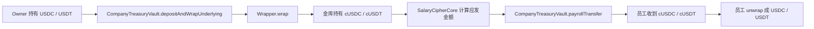

## 8. 技术栈

### 8.1 前端

- Next.js 16
- React 19
- TypeScript
- Tailwind CSS
- shadcn/ui 风格组件
- wagmi
- viem
- Reown AppKit
- Zama relayer SDK
- zod
- dayjs

### 8.2 合约

- Solidity 0.8.27
- Hardhat
- Hardhat Ignition
- Zama fhEVM Solidity library
- OpenZeppelin Contracts
- OpenZeppelin Confidential Contracts
- Solady DateTimeLib
- ERC7984 confidential token wrapper

### 8.3 测试与部署

- Hardhat test
- fhevm mock utils
- 本地 mock ERC20 / mock ERC7984 wrapper
- Sepolia / fork 环境引用 Zama 已部署 USDC、USDT、cUSDC、cUSDT
- Ignition 公共部署模块

## 9. 合约架构

### 9.1 总体关系图

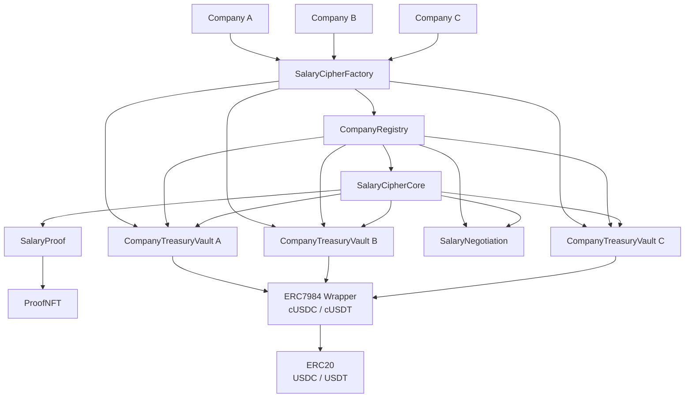

### 9.2 合约职责

| 合约                   | 职责                                                                              |
| ---------------------- | --------------------------------------------------------------------------------- |
| `CompanyRegistry`      | 公司、员工、角色、发薪日、结算资产、金库地址、权限中心                            |
| `SalaryCipherFactory`  | 多租户入口，创建公司并部署该公司的独立金库                                        |
| `SalaryCipherCore`     | 按 `companyId` 管理加密月薪、发薪计算、离职结算、审计、薪资证明条件比较           |
| `CompanyTreasuryVault` | 单公司金库，托管公司资产、wrap underlying token、执行 confidential transfer、退款 |
| `SalaryNegotiation`    | 按 `companyId + employee` 管理加密调薪谈判、密文匹配、应用新月薪                  |
| `SalaryProof`          | 生成收入证明，保存加密验证结果                                                    |
| `ProofNFT`             | 把收入证明铸造成 NFT                                                              |

### 9.3 多租户数据隔离模型

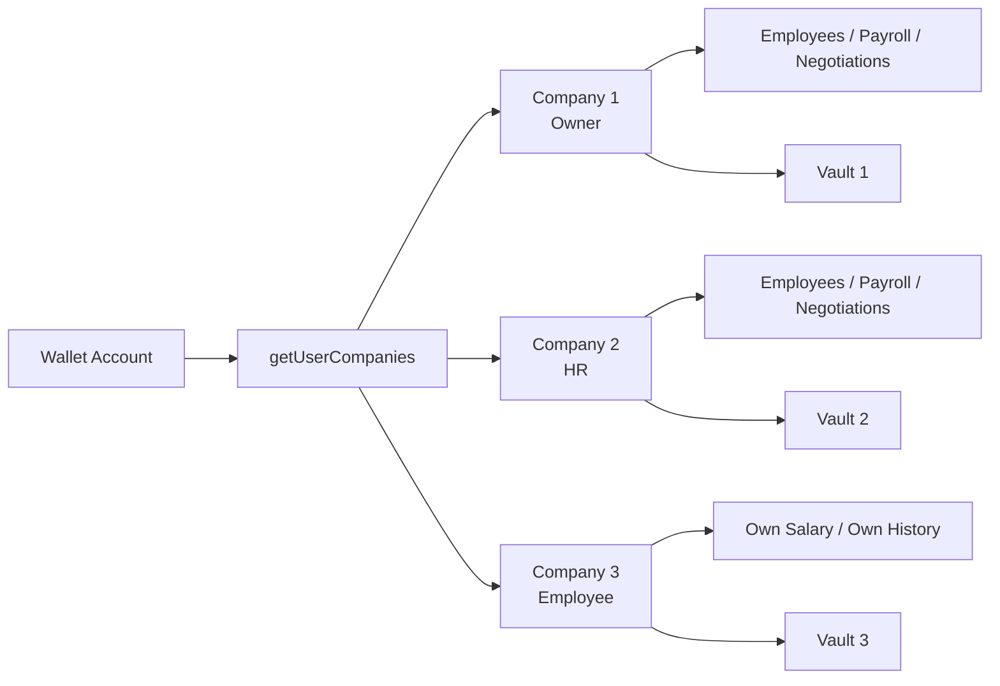

在这个模型里，同一个钱包可以属于多个公司，并在不同公司拥有不同角色。前端选择公司后，页面、菜单、数据读取、链上写入和解密请求都会以当前 `companyId` 为边界。

### 9.4 UML 类图

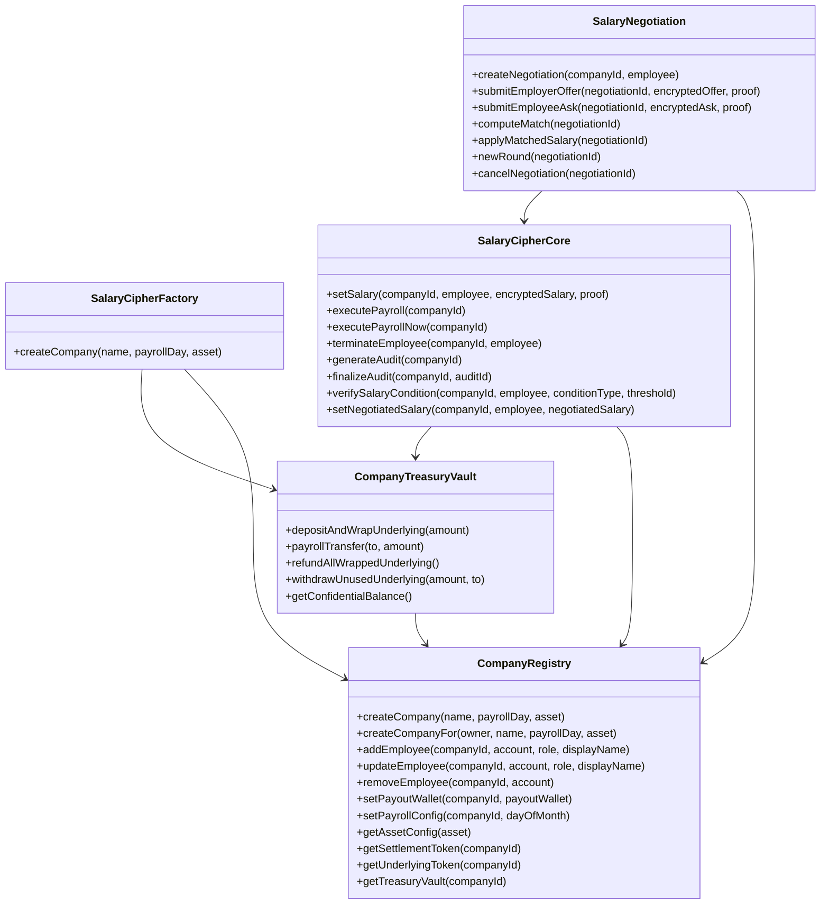

## 10. 前端架构

### 10.1 页面结构

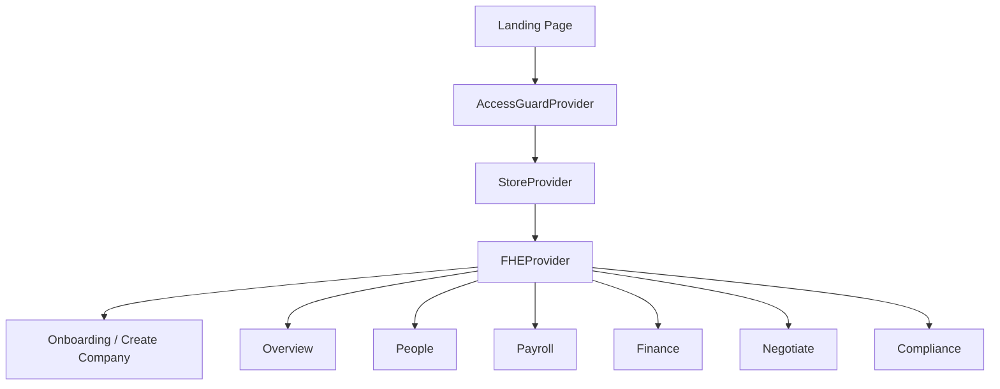

### 10.2 关键前端模块

| 模块                     | 职责                                                   |
| ------------------------ | ------------------------------------------------------ |
| `StoreProvider`          | 钱包级公司列表、公司选择、结算资产读取、创建公司       |
| `AccessGuardProvider`    | 登录态、公司状态、角色路由权限                         |
| `FHEProvider`            | 初始化 FHE 实例和解密能力                              |
| `useCompanyEmployees`    | 员工列表、添加员工、编辑员工、删除员工、月薪加密与解密 |
| `useFinanceVault`        | 金库余额、充值 wrap、退款 unwrap、财务事件             |
| `useOverviewChainData`   | Overview 数据、发薪历史、员工余额、薪资解密            |
| `usePayrollActions`      | 更新发薪日、立即发薪                                   |
| `useSalaryNegotiations`  | 调薪谈判历史、创建、报价、匹配、应用                   |
| `EncryptedField`         | 加密字段展示、单个字段解密、重新隐藏                   |
| `OnchainTransactionLink` | 根据网络展示区块浏览器链接                             |

## 11. 完整前端与合约交互流程

### 11.1 创建公司

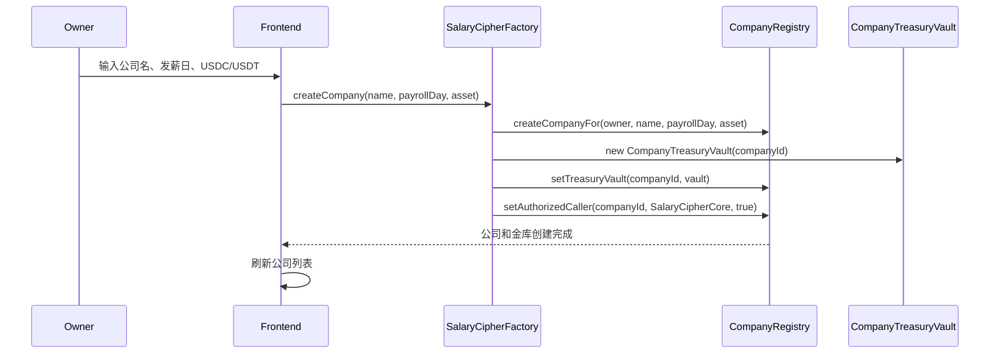

### 11.2 添加员工并设置加密月薪

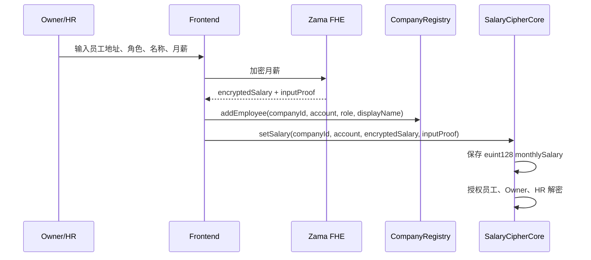

### 11.3 充值并 wrap

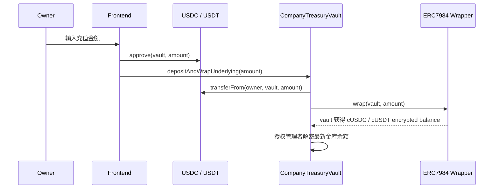

### 11.4 正常发薪

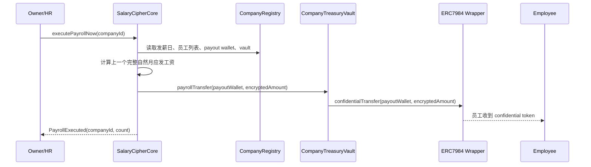

### 11.5 离职结算

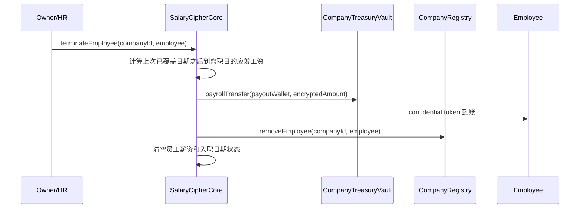

### 11.6 员工 unwrap 已发薪资

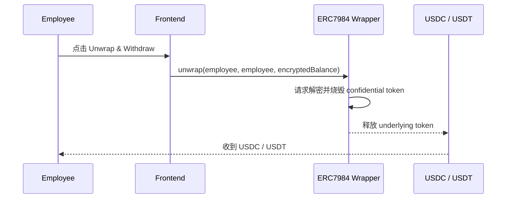

### 11.7 调薪谈判

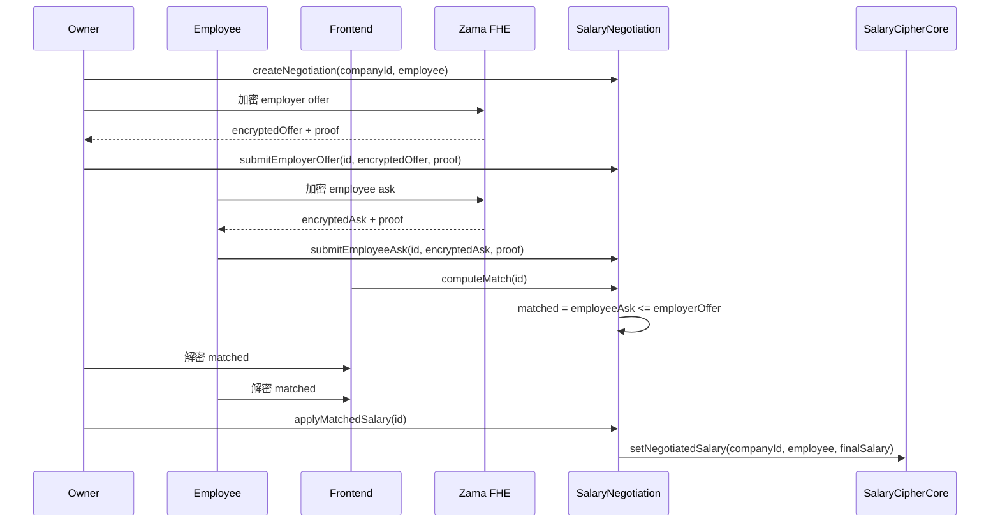

### 11.8 解密展示

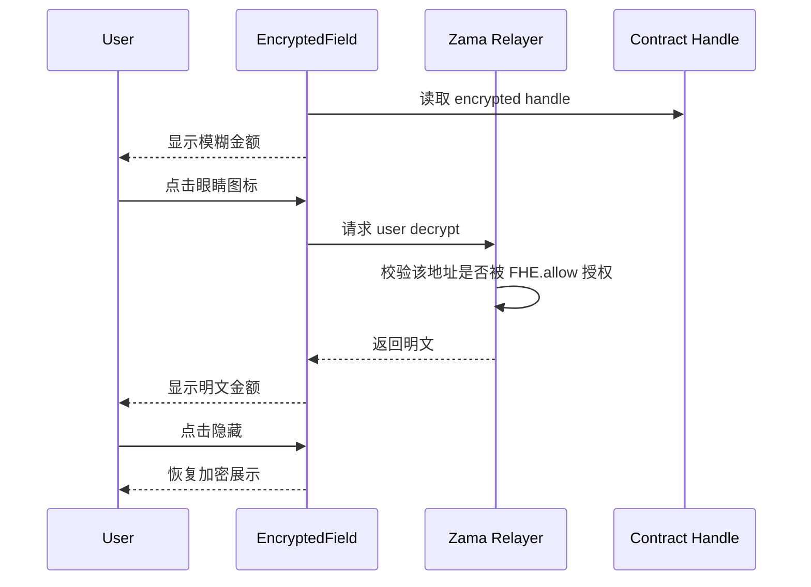

## 12. 支持的资产与部署策略

### 12.1 本地 Hardhat

- 部署 `MockERC20`：mUSDC、mUSDT。
- 部署 `MockConfidentialERC20Wrapper`：cUSDC、cUSDT。
- 为测试账户 mint 本地测试余额。
- 注册 USDC / USDT 两种 supported asset。

### 12.2 Sepolia / Fork

使用 Zama 测试网上已有资产地址（[Sepolia Contract Addresses](https://docs.zama.org/protocol/protocol-apps/addresses/testnet/sepolia)）：

| 资产  | 地址                                         |
| ----- | -------------------------------------------- |
| USDC  | `0x7c5BF43B851c1dff1a4feE8dB225b87f2C223639` |
| USDT  | `0x4E7B06D78965594eB5EF5414c357ca21E1554491` |
| cUSDC | `0x9b5Cd13b8eFbB58Dc25A05CF411D8056058aDFfF` |
| cUSDT | `0xa7dA08FafDC9097Cc0E7D4f113A61e31d7e8e9b0` |

> 注：部署模块会根据网络环境选择本地 mock 部署或引用测试网已有合约。

## 13. 数据与隐私边界

### 13.1 明文数据

- 公司名称。
- 员工显示名称。
- 公司 Owner 地址。
- 员工 account。
- 员工 payout wallet。
- 公司发薪日。
- 公司选择的结算资产。
- 交易哈希、区块高度、事件时间。

这些数据本身在真实链上交互中不可避免公开，或不属于核心薪资隐私。

### 13.2 加密数据

- 员工月薪。
- 发薪金额。
- 金库 confidential balance。
- 员工 confidential token balance。
- 调薪报价。
- 调薪匹配结果。
- 审计薪资总额和差距结论。
- 薪资证明验证结果。

### 13.3 解密权限原则

- 员工能看自己的工资、余额和历史。
- Owner / HR 能看公司管理所需数据。
- 员工不能看其他员工薪资。
- 外部观察者只能看到 encrypted handle，不能看到明文金额。
- 原始谈判报价不开放解密，双方只看匹配结果。

## 14. 项目当前完成度

已完成的核心部分：

- 钱包登录与页面权限守卫。
- 公司创建、公司选择、角色菜单裁剪。
- USDC / USDT 资产配置。
- 每家公司独立金库。
- 员工添加、编辑、删除。
- 加密月薪设置与展示。
- 金库 deposit + wrap。
- 加密发薪与发薪历史索引。
- 员工 confidential balance 展示与 unwrap。
- Owner 金库剩余 wrapped balance 退款流程。
- 按每月发薪日计算工资。
- 离职结算。
- 加密调薪谈判。
- Overview / People / Payroll / Finance / Negotiate 页面链上交互。
- Hardhat Ignition 部署与本地测试基础。

设计中保留并部分实现的扩展方向：

- 薪资公平审计。
- RWA 薪资证明。
- Proof NFT。
- 自动化发薪执行。
- 大规模员工分页发薪。

## 15. 为什么这个项目适合 Zama Bounty

SalaryCipher 展示的是 FHE 在真实商业系统里的完整应用，而不是单点技术演示。薪资管理天然需要隐私，但又需要资产结算、权限控制、历史记录、调薪谈判和合规审计。FHE 正好解决这一类问题：数据保持加密，合约仍然可以执行可信计算。

项目覆盖了 Zama FHE 的多个核心能力：

- 加密输入。
- 密文存储。
- 密文计算。
- 加密布尔结果。
- 授权解密。
- confidential token 资产流。
- 前端可用的解密体验。
- 多租户平台中的按公司隔离与按角色授权。
- 加密竞价式调薪谈判。

最终用户看到的是一个可操作的多公司薪资产品：平台能服务多家公司，公司能充值并发薪，员工能收到加密资产并提现，双方能进行隐私调薪谈判。这让 FHE 从“隐私技术”变成了真实业务流程的一部分。
