# SalaryCipher Project Introduction

## 1. Project Name

**SalaryCipher**

An on-chain private payroll management platform.

## 2. Project Overview

SalaryCipher is a multi-tenant payroll management dApp for enterprises and Web3 teams. Multiple companies can share the same platform contracts, while each company remains isolated through its own `companyId`, role-based permissions, payroll configuration, and dedicated treasury vault. A company can create its organization on-chain, manage employees, configure encrypted monthly salaries, deposit USDC / USDT, wrap them into cUSDC / cUSDT, and pay employees confidential token salaries.

The main weakness of traditional on-chain payment systems is excessive transparency: as soon as an employee wallet address is known, anyone can inspect how much salary that employee received, which company paid it, and how often salary was distributed. SalaryCipher uses Zama FHE to encrypt salary amounts and critical business conclusions, allowing enterprises to preserve the verifiability of on-chain asset settlement while protecting employee income privacy and company labor-cost privacy.

The current version is designed to demonstrate a complete, realistic, and scalable confidential payroll workflow for multiple companies: company creation, asset selection, treasury creation, employee onboarding, encrypted salary storage, funding and wrapping, confidential payroll execution, encrypted balance viewing, employee unwrap withdrawals, payroll history indexing, and encrypted salary negotiation.

## 3. Problems This Project Solves

### 3.1 Employee Salaries Leak on Public Chains

Plain ERC20 transfers expose the full transfer amount. Employees, external analysts, and competitors can inspect salary amounts and company expenses through block explorers.

SalaryCipher addresses this by:

- Storing monthly salaries as FHE-encrypted values.
- Transferring payroll as confidential token transfers.
- Keeping payroll history amounts only as encrypted handles.
- Allowing only the employee, Owner / HR, and other authorized roles to decrypt the relevant data.

### 3.2 Enterprises Cannot Safely Use On-Chain Payroll Tools

Companies want to settle salaries in stablecoins, but they cannot afford to expose compensation structure, team cost, or staffing changes.

SalaryCipher addresses this by:

- Giving each company its own treasury vault.
- Allowing the company to choose either USDC or USDT as the payroll asset.
- Wrapping public ERC20 assets into confidential tokens inside the treasury.
- Triggering payroll directly from the company treasury to the employee payout wallet through contracts.

### 3.3 Salary Negotiation Exposes Both Sides' Bottom Lines

In salary negotiation, both the company's offer and the employee's expectation are sensitive information.

SalaryCipher addresses this by:

- Allowing both Owner and employee to initiate salary negotiations.
- Submitting employer offers and employee asks as encrypted values.
- Letting the contract compare `employeeAsk <= employerOffer` under encryption.
- Revealing only the final conclusion, `Matched` or `Not Matched`.
- Allowing Owner to apply the matched result as the official monthly salary.

### 3.4 Compliance Audits Need Conclusions, Not Raw Details

HR or Owner may need to know whether salary differences are reasonable, but they should not be exposed to plaintext salary details during the audit process.

SalaryCipher addresses this by:

- Computing salary totals, maximums, and minimums under encryption.
- Storing the audit result as an encrypted boolean.
- Allowing authorized roles to decrypt only the conclusion, not every detail.

### 3.5 Multiple Companies Need One Shared Platform, but Data and Assets Must Remain Isolated

A real payroll platform serves many companies. If every company had to maintain its own complete stack, deployment cost, upgrade cost, indexing complexity, and operational overhead would increase significantly.

SalaryCipher addresses this by:

- Sharing platform-level Registry, Core, Negotiation, and other core contracts across all companies.
- Isolating each company's profile, employees, roles, payroll configuration, and payroll history through `companyId`.
- Giving each company its own `CompanyTreasuryVault`, so assets are never mixed in a single treasury.
- Allowing each company to select USDC or USDT independently as its payroll settlement asset.
- Allowing one wallet to belong to multiple companies and switch between companies and roles in the frontend.

## 4. Product Features

### 4.1 Wallet Login and Route Permissions

- Users enter the system by connecting a wallet.
- All pages except the landing page require authentication.
- Unauthenticated access to application pages redirects back to the landing page.
- After login, users without a company are routed to the company creation page.
- After login, users with companies but no selected company are routed to the company selection page.
- Pages and sidebar menus are filtered according to the current company role.

### 4.2 Company Creation and Company Selection

- Users can create a company, and the creator automatically becomes the Owner.
- During company creation, the user sets the company name, monthly payroll day, and payroll settlement asset.
- USDC and USDT are both supported as settlement assets.
- Company creation is completed through `SalaryCipherFactory`, which creates both the company record and the company's dedicated treasury vault.
- When a user belongs to multiple companies, the user can switch companies from the company selection page or the topbar company switch dialog.

### 4.3 Multi-Tenant Company Model

- The platform supports multiple companies running on the same contract system.
- `CompanyRegistry` uses `companyId` to manage each company's metadata, employee list, roles, payroll configuration, settlement asset, and treasury address.
- `SalaryCipherCore` stores each company's encrypted monthly salaries and employee start dates by `companyId + employee`.
- `SalaryNegotiation` stores each employee's encrypted negotiation history within the relevant company by `companyId + employee`.
- `CompanyTreasuryVault` is deployed per company, and only that company's Owner can manage its funds.
- The frontend company selector reads all companies associated with the current wallet and switches menus and data according to the active role.

### 4.4 Multi-Role Permissions

| Role | Permissions |
| --- | --- |
| Owner | Create companies, manage employees, configure payroll day, execute payroll, manage treasury, view company-level history, participate in salary negotiation, and run company compliance audits |
| HR | Manage employees, view people and salary-related data, perform selected payroll management actions, run company compliance audits, and generate their own salary proofs |
| Employee | View personal salary, balance, and history, initiate personal salary negotiation, generate personal salary proofs, and unwrap already paid salaries |

### 4.5 People Management

- Owner / HR can add employees.
- When adding an employee, the form includes the employee account, display name, role, and monthly salary.
- The employee account and payout wallet are separate fields.
- The default payout wallet is the employee account, and the employee can later change their payout wallet.
- Owner / HR can edit employee name and role.
- The employee account cannot be changed during editing.
- Monthly salary cannot be edited from the employee editor; future salary changes must go through encrypted salary negotiation.
- Removing an employee triggers termination settlement, and the contract calculates and transfers the salary owed for the uncovered period.
- Monthly salary is displayed through `EncryptedField`, and authorized users can decrypt it on demand.

### 4.6 Payroll Configuration and Execution

- The company payroll schedule is configured by "which day of the month to pay", not by a fixed duration cycle.
- Each payday settles the work completed in the previous full calendar month.
- If an employee fully covered the previous month, the employee receives the full monthly salary.
- If an employee did not fully cover the previous month, the salary is prorated using the actual number of days in that month.
- If an employee joined during the current month and has not yet completed a previous full month, the payable amount is 0.
- Owner / HR can trigger payroll immediately.
- Immediate payroll executes the next unpaid payroll date early, but still calculates salary based on the previous full calendar month.
- After payroll is executed, the employee's confidential token balance increases and the treasury balance decreases.

### 4.7 Finance and Treasury

- Each company has its own `CompanyTreasuryVault`.
- The Owner can deposit the underlying token selected by the company, such as USDC or USDT.
- After deposit, the vault wraps the underlying token into cUSDC or cUSDT through the wrapper.
- The Owner can view the treasury's wrapped balance, which is shown as an encrypted field.
- The Owner can view the unwrapped underlying token balance that remains in the vault.
- The Owner can initiate unwrap refunds for the treasury's remaining wrapped balance.
- Employees can unwrap the confidential tokens they received into public ERC20 tokens.

### 4.8 Payroll History

- Owner / HR can view the payroll history of all employees in the company.
- Employees can view only their own payroll history.
- Historical amounts are derived from the encrypted handles in the ERC7984 confidential transfer events.
- The frontend presents block number, transaction link, recipient, status, and encrypted amount through event indexing.
- Overview shows only the latest 5 records, while the Payroll page shows the full history.

### 4.9 Encrypted Salary Negotiation

- Only active HR / Employee accounts can participate.
- Owner can initiate negotiation for any employee.
- Employees can initiate negotiation for themselves.
- Owner submits the employer offer.
- Employee submits the employee ask.
- After both values are submitted, the contract computes whether the two sides match.
- The result is an encrypted `ebool` that only the Owner and the corresponding employee can decrypt.
- If the negotiation succeeds, the Owner can apply the new salary.
- If it fails, either side can start a new round.
- The original quoted values are not open for public decryption, so the negotiation process does not reveal company budget ceilings or the employee's private expectation.
- Only one active negotiation is allowed for the same employee at the same time, which prevents conflicting negotiation results.

### 4.10 Overview

Owner / HR view:

- Employee count.
- Total monthly payroll.
- Next payday.
- Recent payroll history.
- Company payroll status.

Employee view:

- My salary.
- My confidential token balance.
- My cumulative received salary.
- My next payday.

### 4.11 Compliance and Salary Proofs

The current version splits company compliance and employee salary proofs into two separate pages:

- Compliance: visible only to Owner / HR; it currently contains only salary fairness auditing. The contract computes salary distribution and gap conclusions under encryption without exposing any individual salary details.
- Salary Proofs: visible only to HR / Employee; Owner does not see this page. Users can only generate, view, revoke, authorize, and mint their own salary proofs. They cannot view other employees' proofs.

Salary Proofs currently supports three fixed proof types: monthly salary greater than or equal to X, monthly salary within the range X to Y, and employment duration greater than or equal to N months. Employees can mint the proof as an RWA NFT. The frontend generates an SVG certificate and uploads it to IPFS, then generates NFT metadata and uploads that to IPFS as well, and finally writes the metadata `tokenURI` into the NFT. Neither the SVG nor the metadata contains the real salary, employee name, or decrypted result. Third parties must rely on the on-chain proof status and employee authorization to verify the conclusion.

## 5. The Real-World Value of FHE

SalaryCipher is not merely storing encrypted data on-chain. It uses FHE as part of a real payroll workflow.

| Scenario | Problem Without FHE | Outcome With FHE |
| --- | --- | --- |
| Monthly salary | Plaintext on-chain data leaks income | Monthly salary is stored in encrypted form and decrypted only by authorized parties |
| Payroll amount | Transfer amounts are public | Confidential tokens are used for encrypted transfers |
| Treasury balance | External parties can analyze company cash flow | Wrapped balance is shown in encrypted form |
| Termination settlement | Salary must be computed in public | The contract computes payable amounts under encryption |
| Encrypted bidding / salary negotiation | Both sides' offers are exposed | Offers are encrypted, and only the match result is public |
| Salary audit | Audits would expose personal salary details | Only the audit conclusion is decrypted |
| Income proof | Proofs often reveal the actual salary | Only the qualifying condition is proven |
| Multi-tenant payroll platform | Shared systems can easily mix permissions and assets | `companyId` isolates data and separate vaults isolate assets |

The value of FHE lies in the fact that contracts can perform addition, multiplication, division, comparison, and conditional selection on encrypted data. The business rules remain enforceable on-chain, while observers still cannot read the original values.

## 6. Product Advantages

### 6.1 Multi-Tenant Platform Model

SalaryCipher allows many companies to share one contract system without deploying a separate full stack for each company. The platform isolates companies, employees, roles, salaries, negotiations, and history through `companyId`, and isolates assets through a dedicated `CompanyTreasuryVault` for each company. This design is much closer to a real SaaS payroll platform and is more suitable for future large-scale enterprise adoption.

### 6.2 Real Asset Flow, Not a Demo Ledger

SalaryCipher uses OpenZeppelin Confidential Contracts' ERC7984 wrapper. Companies deposit public ERC20 assets and wrap them into confidential tokens. Payroll transfers real confidential assets, rather than simply updating an internal bookkeeping field.

### 6.3 Company-Level Treasury Isolation

Each company has its own treasury vault. Platform core contracts isolate business data with `companyId`, while asset custody is handled by each company's own vault. This improves risk isolation, balance visibility, and refund handling.

### 6.4 Encrypted Salary Negotiation

SalaryCipher turns salary negotiation into a private matching process between two encrypted quotes. The Owner's employer offer and the employee's ask are never exposed in plaintext. The contract only determines whether the two sides match under encryption. Both parties only see Match / No Match, and the Owner can apply the new salary after a successful match. This demonstrates the direct value of FHE for private comparison scenarios and turns salary negotiation into a verifiable on-chain privacy workflow.

### 6.5 Payroll Rules Close to Real Salary Operations

Payroll is calculated by calendar month rather than by a fixed 30-day or fixed-second cycle. Each payday settles the previous full calendar month, and employees who did not complete a full month are prorated using the actual days in that month.

### 6.6 Clear Permission and Decryption Boundaries

Different roles see different pages, different lists, different buttons, and different decryption capabilities. Unauthorized users may still see encrypted handles on-chain, but they cannot decrypt the amounts.

### 6.7 Complete Frontend and Contract Workflow

The project includes a Next.js frontend, Hardhat Ignition deployment, Solidity contracts, Zama FHE encrypted inputs, wagmi on-chain reads and writes, event indexing, encrypted field decryption components, and a test suite.

## 7. How Zama FHE Is Used

### 7.1 Encrypted Inputs

The frontend uses Zama relayer / FHE SDK to encrypt the user's amount input and generate encrypted handles and input proofs.

Typical examples:

- Encrypting monthly salary when adding an employee.
- Editing an employee without changing the salary, so no new salary is submitted.
- Encrypting employer offers and employee asks during negotiation.

The contract receives `externalEuint128` and `inputProof`, then converts them into an on-chain computable encrypted value through `FHE.fromExternal`.

### 7.2 Encrypted Storage

Core encrypted fields include:

| Field | Type | Contract |
| --- | --- | --- |
| Employee monthly salary | `euint128` | `SalaryCipherCore` |
| Payroll amount | `euint64` / `euint128` | `SalaryCipherCore` + `CompanyTreasuryVault` |
| Treasury wrapped balance | `euint64` | ERC7984 wrapper |
| Salary negotiation quote | `euint128` | `SalaryNegotiation` |
| Negotiation match result | `ebool` | `SalaryNegotiation` |
| Audit total amount | `euint128` | `SalaryCipherCore` |
| Audit conclusion | `ebool` | `SalaryCipherCore` |

### 7.3 FHE Permission Control in a Multi-Tenant Setting

FHE authorization in SalaryCipher is not global; it is assigned by company and role. Employees can decrypt only their own salary and receipt history within the current company. Owner / HR can decrypt only the data within the company they manage. When one wallet belongs to multiple companies, the encrypted handle permissions of each company remain independent. This supports a realistic multi-tenant scenario in which the same wallet may be an Owner in company A and an Employee in company B.

### 7.4 Encrypted Computation

Contracts use FHE operations to implement business logic:

- `FHE.add`: aggregate salaries and payable amounts.
- `FHE.mul` / `FHE.div`: prorate salary by actual working days.
- `FHE.le` / `FHE.ge` / `FHE.eq`: negotiation matching, salary proof checks, and audit comparisons.
- `FHE.select`: choose results under encrypted conditions so that even the false branch can be safely decrypted.
- `FHE.asEuint` / `FHE.asEbool`: initialize encrypted constants.

### 7.5 Decryption Authorization

Contracts use `FHE.allow` and `FHE.allowThis` to control who can decrypt:

- Employee monthly salary: the employee, Owner, HR, and core contract.
- Payroll transfer amount: the employee and roles with management permissions.
- Treasury balance: Owner / HR.
- Negotiation result: the Owner and the corresponding employee.
- Original negotiation quotes: not open to external decryption.

### 7.6 Confidential Token

SalaryCipher uses the ERC7984 wrapper for real assets:

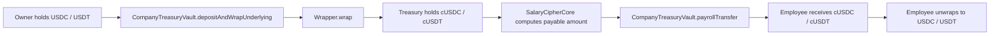

## 8. Tech Stack

### 8.1 Frontend

- Next.js 16
- React 19
- TypeScript
- Tailwind CSS
- shadcn/ui-style components
- wagmi
- viem
- Reown AppKit
- Zama relayer SDK
- zod
- dayjs

### 8.2 Contracts

- Solidity 0.8.27
- Hardhat
- Hardhat Ignition
- Zama fhEVM Solidity library
- OpenZeppelin Contracts
- OpenZeppelin Confidential Contracts
- Solady DateTimeLib
- ERC7984 confidential token wrapper

### 8.3 Testing and Deployment

- Hardhat test
- fhevm mock utils
- Local mock ERC20 / mock ERC7984 wrapper
- Sepolia / fork environments use Zama's deployed USDC, USDT, cUSDC, and cUSDT
- Ignition public deployment modules

## 9. Contract Architecture

### 9.1 Overall Relationship Diagram

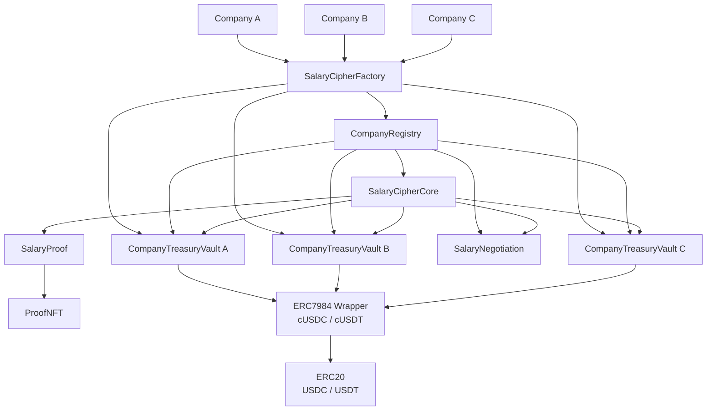

### 9.2 Contract Responsibilities

| Contract | Responsibility |
| --- | --- |
| `CompanyRegistry` | Company metadata, employees, roles, payroll day, settlement assets, treasury address, and access control center |
| `SalaryCipherFactory` | Multi-tenant entry point that creates a company and deploys that company's dedicated treasury vault |
| `SalaryCipherCore` | Manages encrypted monthly salaries, payroll computation, termination settlement, audits, and salary proof comparisons by `companyId` |
| `CompanyTreasuryVault` | Single-company treasury that custody funds, wraps underlying tokens, executes confidential transfers, and handles refunds |
| `SalaryNegotiation` | Manages encrypted salary negotiations by `companyId + employee`, confidential matching, and application of the final salary |
| `SalaryProof` | Generates income proofs, stores encrypted verification results, and controls authorization, revocation, and NFT minting |
| `ProofNFT` | Mints the income proof as an RWA NFT and stores the proofId and tokenURI |

### 9.3 Multi-Tenant Data Isolation Model

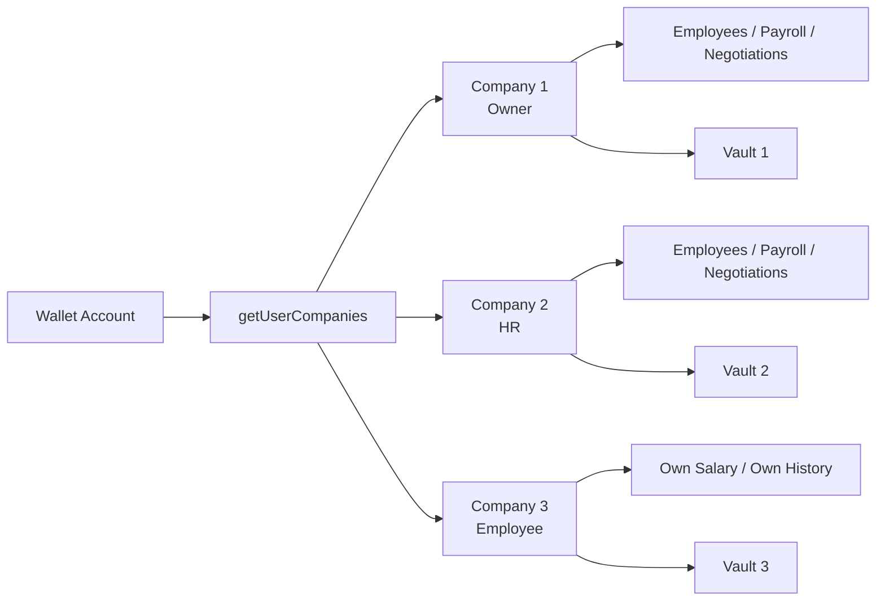

In this model, the same wallet may belong to multiple companies and may hold different roles in different companies. After a company is selected in the frontend, the page, menus, data reads, contract writes, and decryption requests all use the current `companyId` as the boundary.

### 9.4 UML Class Diagram

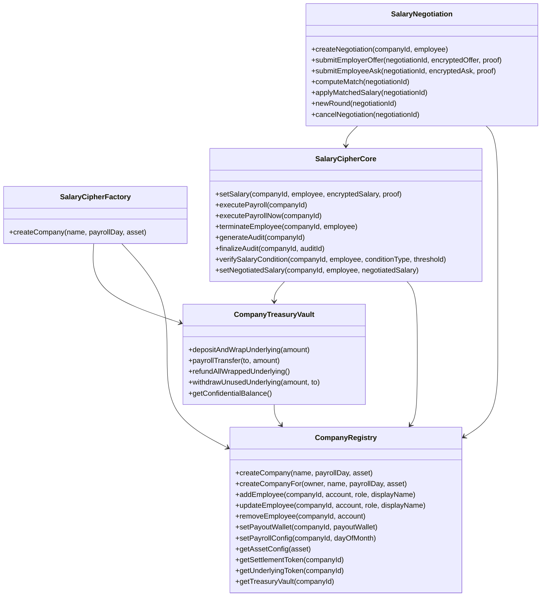

## 10. Frontend Architecture

### 10.1 Page Structure

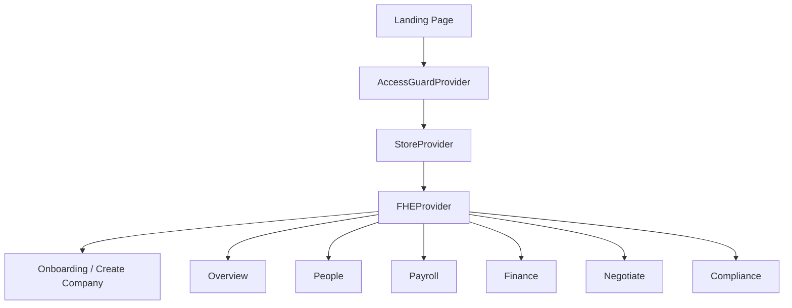

### 10.2 Core Frontend Modules

| Module | Responsibility |
| --- | --- |
| `StoreProvider` | Wallet-level company list, company selection, settlement asset lookup, and company creation |
| `AccessGuardProvider` | Login state, company state, and role-based route permissions |
| `FHEProvider` | Initializes the FHE instance and decryption capabilities |
| `useCompanyEmployees` | Employee list, add employee, edit employee base info, delete employee, encrypted initial salary storage, and salary decryption |
| `useFinanceVault` | Treasury balance, deposit and wrap, refund unwrap, and finance events |
| `useOverviewChainData` | Overview data, payroll history, employee balance, and salary decryption |
| `usePayrollActions` | Update payroll day and execute payroll immediately |
| `useSalaryNegotiations` | Salary negotiation history, creation, quoting, matching, and application |
| `EncryptedField` | Encrypted field display, single-field decryption, and re-hiding |
| `OnchainTransactionLink` | Block explorer links that adapt to the current network |

## 11. Complete Frontend and Contract Flow

### 11.1 Company Creation

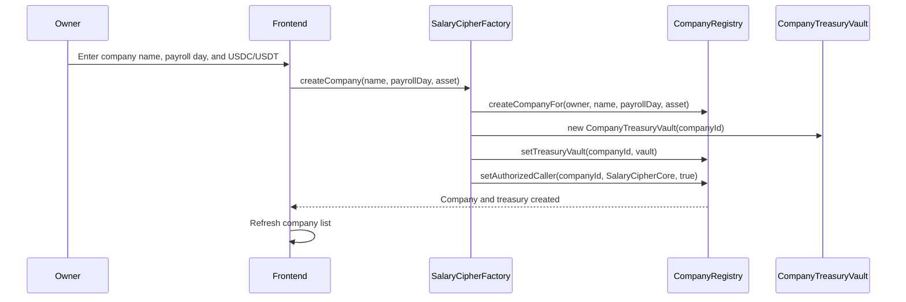

### 11.2 Add Employee and Set Encrypted Monthly Salary

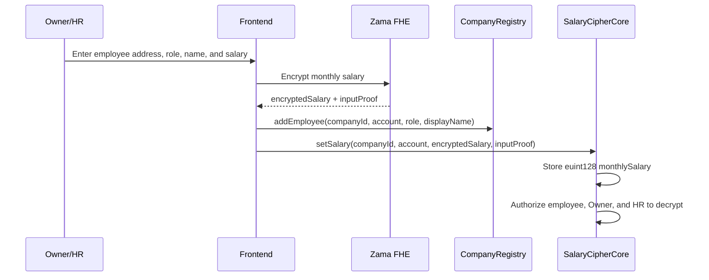

### 11.3 Deposit and Wrap

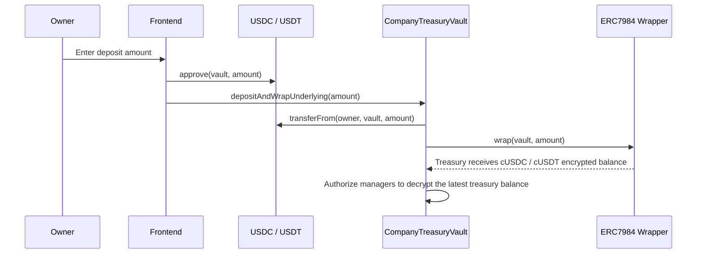

### 11.4 Normal Payroll Execution

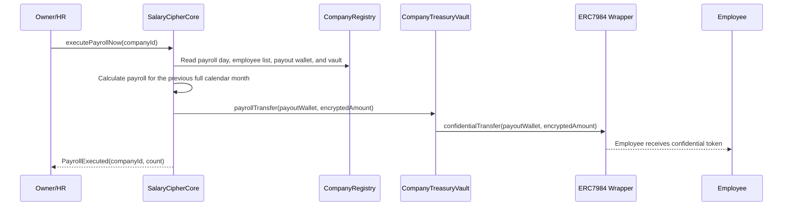

### 11.5 Termination Settlement

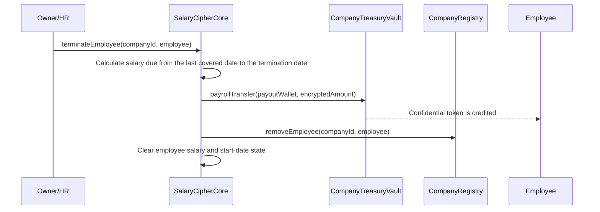

### 11.6 Employee Unwraps Paid Salary

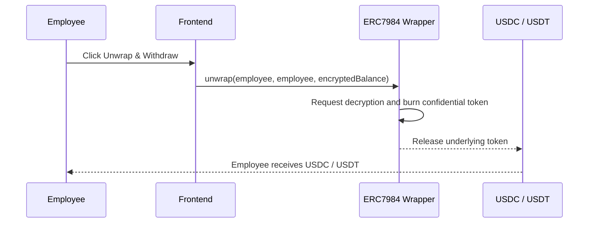

### 11.7 Salary Negotiation

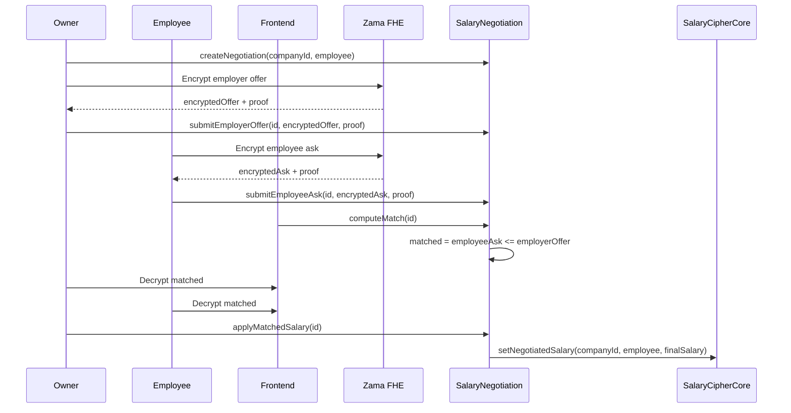

### 11.8 Decrypted Display

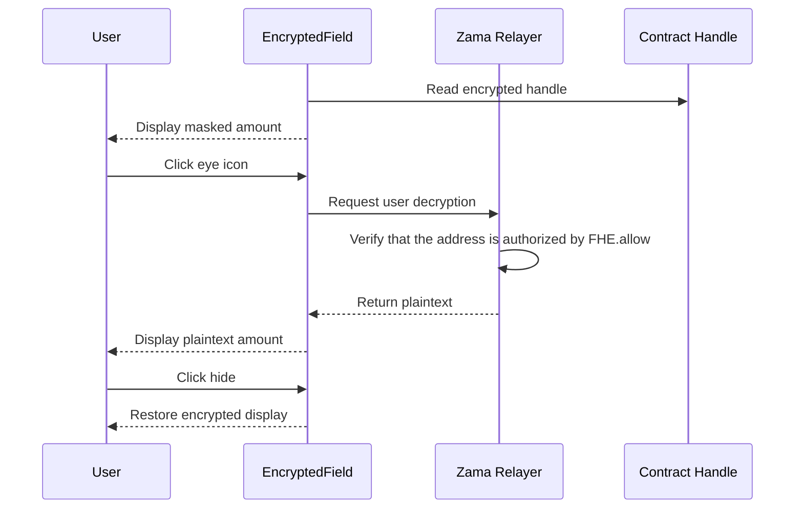

## 12. Supported Assets and Deployment Strategy

### 12.1 Local Hardhat

- Deploy `MockERC20`: mUSDC, mUSDT.
- Deploy `MockConfidentialERC20Wrapper`: cUSDC, cUSDT.
- Mint local test balances to test accounts.
- Register both USDC and USDT as supported assets.

### 12.2 Sepolia / Fork

Use the already deployed Zama testnet addresses ([Sepolia Contract Addresses](https://docs.zama.org/protocol/protocol-apps/addresses/testnet/sepolia)):

| Asset | Address |
| --- | --- |
| USDC | `0x7c5BF43B851c1dff1a4feE8dB225b87f2C223639` |
| USDT | `0x4E7B06D78965594eB5EF5414c357ca21E1554491` |
| cUSDC | `0x9b5Cd13b8eFbB58Dc25A05CF411D8056058aDFfF` |
| cUSDT | `0xa7dA08FafDC9097Cc0E7D4f113A61e31d7e8e9b0` |

> Note: the deployment module selects either local mock deployments or the already deployed testnet contracts based on the network environment.

## 13. Data and Privacy Boundaries

### 13.1 Plaintext Data

- Company name.
- Employee display name.
- Company Owner address.
- Employee account.
- Employee payout wallet.
- Company payroll day.
- The settlement asset selected by the company.
- Transaction hashes, block heights, and event timestamps.

These values are either unavoidable on-chain metadata or are not part of the core salary privacy surface.

### 13.2 Encrypted Data

- Employee monthly salary.
- Payroll amount.
- Treasury confidential balance.
- Employee confidential token balance.
- Salary negotiation quotes.
- Salary negotiation match result.
- Audit salary total and gap conclusion.
- Salary proof verification result.

### 13.3 Decryption Principles

- Employees can view their own salary, balance, and history.
- Owner / HR can view the data required for company management.
- Employees cannot view other employees' salaries.
- Owners cannot access the salary-proof page for employees; HR can only view their own salary proofs.
- External observers can only see encrypted handles, not plaintext amounts.
- Original negotiation quotes are not open for decryption; both sides only see the matching result.

## 14. Current Project Completion Status

Completed core areas:

- Wallet login and page access guards.
- Company creation, company selection, and role-based menu filtering.
- USDC / USDT asset configuration.
- Dedicated treasury vault per company.
- Employee add, edit, and delete flows.
- Encrypted salary setup and display.
- Treasury deposit + wrap.
- Confidential payroll execution and history indexing.
- Employee confidential balance display and unwrap.
- Owner treasury remaining wrapped balance refund flow.
- Payroll calculation by monthly payday.
- Termination settlement.
- Encrypted salary negotiation.
- On-chain interaction for the Overview / People / Payroll / Finance / Negotiate pages.
- Hardhat Ignition deployment and local testing foundation.

Extension directions retained in the design and partially implemented:

- Salary fairness auditing.
- RWA salary proofs.
- Proof NFT, IPFS SVG certificates, and IPFS metadata.
- Automated payroll execution.
- Large-scale employee paginated payroll execution.

## 15. Why This Project Fits the Zama Bounty

SalaryCipher demonstrates a complete FHE application in a real commercial system, rather than a single-point technical demo. Payroll management naturally requires privacy, but it also requires asset settlement, permission control, historical records, salary negotiation, and compliance auditing. FHE is a direct fit for this class of problems: data remains encrypted while the contract still performs trustworthy computation.

The project covers several core capabilities of Zama FHE:

- Encrypted inputs.
- Encrypted storage.
- Encrypted computation.
- Encrypted boolean results.
- Authorized decryption.
- Confidential token asset flow.
- A user-facing decryption experience.
- Multi-tenant company isolation with role-based permissions.
- Encrypted bidding-style salary negotiation.

The final user sees a practical multi-company payroll product: the platform serves many companies, companies can deposit and pay salaries, employees can receive encrypted assets and withdraw them, and both sides can conduct private salary negotiations. This turns FHE from a privacy technology into a real part of a business workflow.
